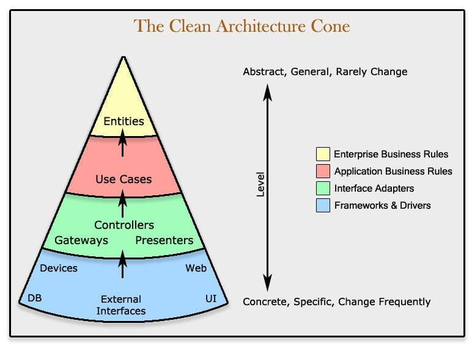

<p align="center">  </p>
<h1 align="center"> Feedback.io </h1>

[](https://github.com/gabriellopes00/feedbackio-api/actions/workflows/main.yml)
[](https://coveralls.io/github/gabriellopes00/feedbackio-api?branch=main)
[](https://github.com/gabriellopes00/feedbackio-api/blob/main/LICENSE.md)


[](https://sonarcloud.io/dashboard?id=gabriellopes00_feedbackio-api)
[](https://sonarcloud.io/dashboard?id=gabriellopes00_feedbackio-api)
[](https://sonarcloud.io/dashboard?id=gabriellopes00_feedbackio-api)
[](https://sonarcloud.io/dashboard?id=gabriellopes00_feedbackio-api)
[](https://sonarcloud.io/dashboard?id=gabriellopes00_feedbackio-api)

###### An API built with

<p>
  
  
  
  
  
  
  
  
  
  
  
</p>

##### Application hosted at _[heroku](https://www.heroku.com/)_.

##### API url: _https://feedbackio-api.herokuapp.com_.

<h2> About Feedback.io 📚 </h2>

<p>
  Feedback.io is being built to offer a complete platform for everyone seeing have a better control over their services, and their customers opinion about them. Here you can register yourself on the platform and create services, that will be able to receive feedbacks and rates from your customers. This will allow you have a contact with customers feedbacks, which can be a ISSUE, an IDEA, or OTHERS, and calculate your services NPS, knowing how your customers are evaluating your services. This is an open source application, which is begin built using Nodejs, including a lot of other concepts and new technologies such as Typescript, SOLID principles, Clean Architecture, DDD, TDD, Docker, PostgreSQL, Redis...
</p>

## Api Structure


This project structure is inspired in clean architecture code structure, [by Uncle Bob](https://blog.cleancoder.com/uncle-bob/2012/08/13/the-clean-architecture.html). The main purpose of clean architecture, hexagonal architecture, and others softwares architecture structure, is creating a **_strong_**, **_readable_**, **_understandable_** and **_maintainable_** project code, splitting all the application code in layers, each one with their own responsibilities and characteristics. The best advantage of using it, is create a application independent of any frameworks, tool, database or technology _(infra layer)_, being easy to handle the code, create a new features, fix any issue, or change some framework, becoming less vulnerable to changes to frameworks and libs, thanks to the adapters and ports technique, that make this frameworks being just a part of the software, and uncoupling them to the domain business rules.



As is shown in the images, the ideia is that external layers can know internal layers, but **never** the opposite, because a framework, for example, can know the entity, to execute specific tasks. But domain is totally independent of external libs, so it never know each lib or framework is persisting the data for example.

#### Folders Structure 🗂

```
root
├── .github                 → Github files
│     └── assets
│     └── workflow
├── src                     → Application main code
│    │── app                → Composition layer, entry point code, server setup...
│    │    └── server.ts     → Server entry point
│    ├── domain             → Business rules and entities definition
│    ├── infra              → External frameworks and libs ports implementation (orm, encrypter)
│    ├── presentation       → External api communication layer (controllers, validators)
│    ├── usecases           → Usecases implementation
│    └── services           → Services implementation
└─── tests                  → Application tests code
      └── e2e
      └── unit
```

#### Security 🔒

Users password are hashed with [Argon2](https://github.com/P-H-C/phc-winner-argon2) hasher, winner of the [Password Hashing Competition (PHC)](https://www.password-hashing.net/), the most recommended and secure hashing algorithm option.
Authentications tokens are generated using [JWT](https://jwt.io/), most used tool to generate authentication tokens for web applications, which are encoded with a key pair of [RSA](<https://en.wikipedia.org/wiki/RSA_(cryptosystem)>) keys using RS256 asymmetric cryptography algorithm, increasing token's authenticity.

## Building and running 🛠

To run this project locally, you will have to install Nodejs and PostgreSQL on the machine, or run everything with Docker and docker-compose. Before run the project, go to **_.env.example_** file, on project root, and rename it to **_.env_** only, filling all the properties in the file with your information _(api port, db credentials...)_. Public and private keys must be generated with the commands below, and pasted in ._.env_ file, with `\n` and _no spaces_ after each line.

###### Cloning Repository

```git
git clone https://github.com/gabriellopes00/feedbackio-api.git
or
git clone git@github.com:gabriellopes00/feedbackio-api.git
```

###### Generating RSA key pair

```bash
npm run gen:key:pair
or
openssl genrsa -out <private_key_name>.pem 1024 &&
openssl rsa -pubout -in <private_key_name>.pem -out <public_key_name>.pem
```

###### Running with Docker

```bash
docker-compose up -d
```

###### Running locally

```bash
npm install
npm run build
npm run start
```

###### Tests (jest) 🧪

- _**All**_ ❯ `yarn test`
- _**Coverage**_ ❯ `yarn test:ci`
- _**Unit**_ ❯ `yarn test:unit`
- _**e2e**_ ❯ `yarn test:e2e`

###### Linting (eslint and prettier) 🎭

- _**Lint**(eslint)_ ❯ `yarn lint`
- _**Style**(prettier)_ ❯ `yarn style`

###### Statistics of the types of commits 📊📈

Following the standard of the [Conventional Commits](https://www.conventionalcommits.org/).

- _**feature** commits(amount)_ ❯ `git shortlog -s --grep feat`
- _**test** commits(amount)_ ❯ `git shortlog -s --grep test`
- _**refactor** commits(amount)_ ❯ `git shortlog -s --grep refactor`
- _**chore** commits(amount)_ ❯ `git shortlog -s --grep chore`
- _**docs** commits(amount)_ ❯ `git shortlog -s --grep docs`
- _**build** commits(amount)_ ❯ `git shortlog -s --grep build`

## License ✒

This project uses [GPL-3.0](https://github.com/gabriellopes00/feedbackio-api/blob/main/LICENSE.md) license, which allows anyone modify, distribute and use the application code in many different ways. However there are many conditions, such as **License and copyright notice**, **State changes**, **Disclose source** and **Use the same license**. [Read complete license](https://github.com/gabriellopes00/feedbackio-api/blob/main/LICENSE.md) to know more about permissions and copyright.

## Contact 📱

[](https://github.com/gabriellopes00)
[](https://www.linkedin.com/in/gabriel-lopes-6625631b0/)
[](https://twitter.com/_gabrielllopes_)
[](mailto:gabrielluislopes00@gmail.com)
[](https://www.facebook.com/profile.php?id=100034920821684)
[](https://www.instagram.com/_.gabriellopes/?hl=pt-br)
[](https://stackoverflow.com/users/14099025/gabriel-lopes?tab=profile)
